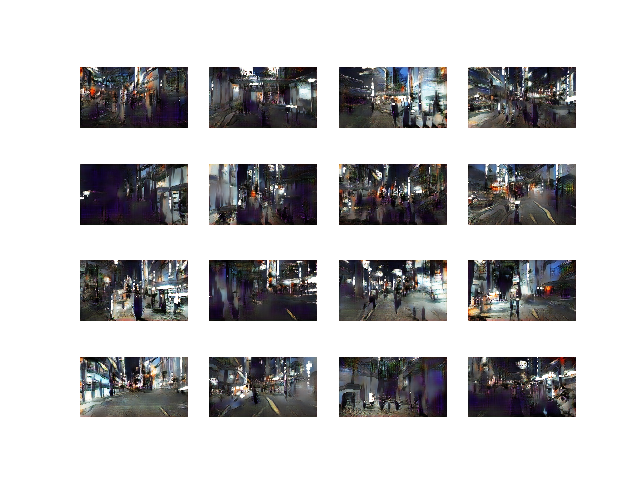

<h2>Video frame generation using DCGAN</h2>

Generative Adverserial Networks<a href="https://arxiv.org/pdf/1406.2661.pdf">(GANs)</a> have been fairly successful in image generation tasks.GANs produce sharp images with lot of details but are quite difficult to train due to being a competetive game between two networks - discriminator(D) and the generator(G). Each training step changes the nature of the optimization problem and as such may fall into myriad local minima leading to failures 

To stablize the training, various architectures and mechanisms have been suggested with the earliest being Deep Convolutional GAN(<a href="https://arxiv.org/pdf/1511.06434.pdf">DCGAN</a>). DCGAN was a result of exhaustive emperical experiments with tuning of various hyperparameters and architectures.DCGAN are easy to setup and train. They don't offer the best output in terms of quality but are fairly adaptable to different type of image generation tasks.

 In this repo, I've attempted to generate individual frames from a city-walk <a href="https://www.youtube.com/watch?v=vHr4qSQ-5XU">video</a>(video credit:Rambalac).
The problem is interesting to me as a way to generate automatic city-walk videos. 
This DCGAN model generates 160x320 images which is non-standard as far as conventional implementations of GANs are concerned.

This implementation of DCGAN can be found <a href="https://machinelearningmastery.com/how-to-develop-a-generative-adversarial-network-for-a-cifar-10-small-object-photographs-from-scratch/">here</a> with slight architectural change.
<h3>Training procedure</h3>
First the video is split into individual frames using OpenCV -frame skipping is used to keep the frame count around 10k, and then fed to the GAN network and trained for 500 epochs. Due to the stochastic nature of problem , the training may not run fully upto 500 epochs and may fail after 100 epochs. The model starts generating natural looking images after 60-70 epochs.
The inference scripts can then be used to generate sample plots and frames from the saved models.

For training: 
<i>python train_unconditional_gan.py</i>
or 
 
<i>python train_unconditional_gan_big.py</i> (slight change in training procedure which doesn't use shuffled images from the video)

For test: 
<i>python inference_unconditional_gan.py</i>

<h3>Limitations</h3>
Since this is a complex problem as the network is not able to model all the details in the scenes(people,building,cars,lights etc.) but it learns a rough approximation of the individual scenes. Also the concept of time (what frame comes after current ) is a bit difficult to model for the network but that can be alleviated slightly with correct ordering of the images.

<h3>Future work</h3>
1. Generating higher resolutions frames with progressive GANs
2. Use of better optimization (loss) functions 
